## Project Spiderverse
### GitHub Desktop
-   Descargar repositorio

    - **Descargar el repositorio con GitHub Desktop**
        | Para descargar el repositiorio usaremos la opción de ***"File"***|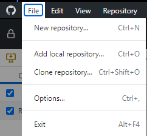|
        |-|-|
        |Al darle a la opción de ***"Clone Repository"*** aparecera la siguiente pestaña:|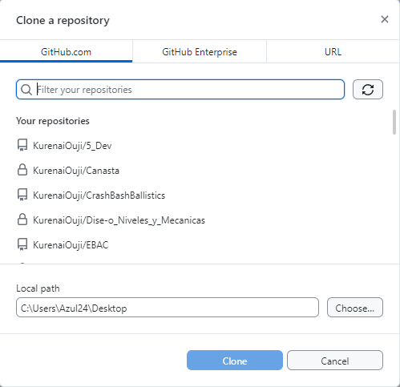|
        |En esta pestaña podermos buscar el nombre de nuestro proyecto en el cual seamos colaboradores.|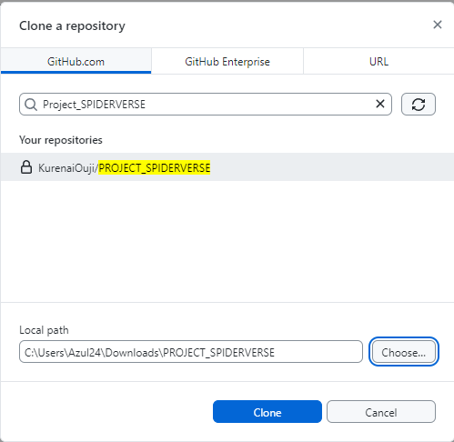|
        |Le daremos a la opcion de ***Chose*** para seleccionar el lugar donde queremos guardar el repositorio|Le daremos *Click* en **Clone** para descargar el repositorio|

    - **Descargar el repositorio con GitHub Desktop URL**

        |Tambien podemos usar la opción de URL que se encuentra a la derecha|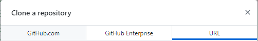|
        |-|-|
        |Para poder usar la opción de URL, necesitaremos conseguirlo desde internet|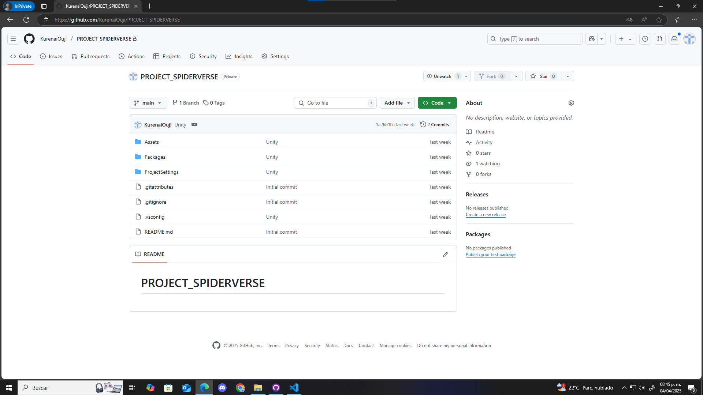|
        |Al darle a la opcion verde de nombre ***"<> Code"*** aparecera el siguiente menu|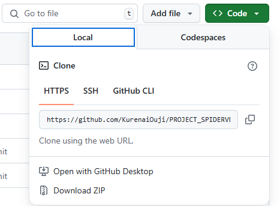|
        |Solo tendremos que copiar el **URL** que aparece|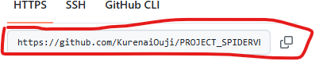|
        |Tendremos que copiar el **URL** en el primer recuadro|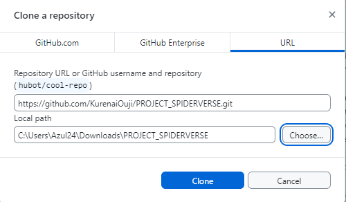|
        |La segunda opcion es para elegir en que parte de nuestra computadora guardaremos el proyecto|Le daremos *Click* a **Clone** para descargar el repositorio|

- **Cambiar de Rama**

    |Rama Artista||
    |-|-|
    |Para cambiarnos de **Rama ("Branch")**, ubicaremos el boton que se encuentra en la parte de arriba de GitHub Deskop con el mismo nombre.|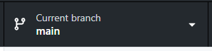|
    |Al darle Click al boton nos saldra un nuevo menu en el cual encontraremos todas kas Ramas (Branch) que tiene nuestro proyecto.||

- **Subir archivos**

    |Ubicar Carpetas||
    |-|-|
    |Para encontrar rapidamente nuestro proyecto, podemos dar *Click* derecho en el nombre del proyecto|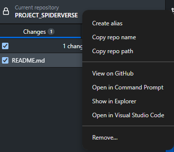|
    |En el menu encontraremos una opcion que dice **Show in Explorer** (**Mostar en el explorador**)|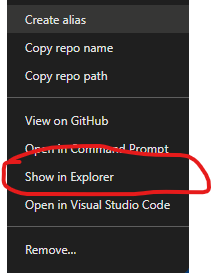|
    |De esta dorma podemos acceder a al acarpeta rapidamente|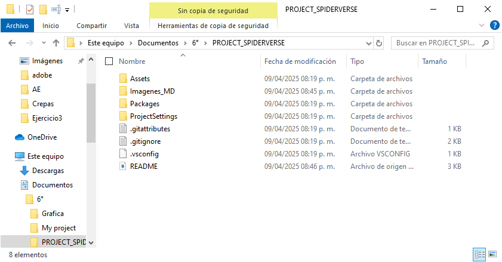|
