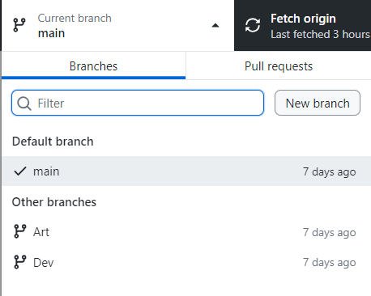
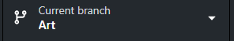

## Project Spiderverse

### GitHub Desktop

- Descargar repositorio

  - **Descargar el repositorio con GitHub Desktop**
    | Para descargar el repositiorio usaremos la opción de **_"File"_**||
    |-|-|
    |Al darle a la opción de **_"Clone Repository"_** aparecera la siguiente pestaña:||
    |En esta pestaña podermos buscar el nombre de nuestro proyecto en el cual seamos colaboradores.||
    |Le daremos a la opcion de **_Chose_** para seleccionar el lugar donde queremos guardar el repositorio|Le daremos _Click_ en **Clone** para descargar el repositorio|

  - **Descargar el repositorio con GitHub Desktop URL**

    | Tambien podemos usar la opción de URL que se encuentra a la derecha                          |  |
    | -------------------------------------------------------------------------------------------- | --------------------------------------------------------------------------- |
    | Para poder usar la opción de URL, necesitaremos conseguirlo desde internet                   |          |
    | Al darle a la opcion verde de nombre **_"<> Code"_** aparecera el siguiente menu             |          |
    | Solo tendremos que copiar el **URL** que aparece                                             |     |
    | Tendremos que copiar el **URL** en el primer recuadro                                        |    |
    | La segunda opcion es para elegir en que parte de nuestra computadora guardaremos el proyecto | Le daremos _Click_ a **Clone** para descargar el repositorio                |

- **Cambiar de Rama**

  | Rama Artista                                                                                                                             |                                                                                      |
  | ---------------------------------------------------------------------------------------------------------------------------------------- | ------------------------------------------------------------------------------------ |
  | Para cambiarnos de **Rama ("Branch")**, ubicaremos el boton que se encuentra en la parte de arriba de GitHub Deskop con el mismo nombre. |   |
  | Al darle Click al boton nos saldra un nuevo menu en el cual encontraremos todas las Ramas (Branch) que tiene nuestro proyecto.           |  |
  | Seleccionamos la Rama deseada, en este caso **ART**, Si el cambio fue exitoso, nuestro se verade esta forma:                             |     |

- **Subir archivos**

  | Ubicar Carpetas                                                                                                                                             |                                                                                                                                                           |
  | ----------------------------------------------------------------------------------------------------------------------------------------------------------- | --------------------------------------------------------------------------------------------------------------------------------------------------------- |
  | Para encontrar rapidamente nuestro proyecto, podemos dar _Click_ derecho en el nombre del proyecto                                                          |                                                                                |
  | En el menu encontraremos una opcion que dice **Show in Explorer** (**Mostar en el explorador**)                                                             |                                                                      |
  | De esta dorma podemos acceder a la acarpeta rapidamente                                                                                                     |                                                                             |
  | Nos dirijiremos a la carpeta **Assets**                                                                                                                     | Dentro encontraremos la carpeta **Arte**                                                                                                                  |
  | Dentro de la carpeta **Arte** podremos guardar los archivos en sus carpetas correspondientes                                                                |                                                                                                                                                           |
  | Ejemplo                                                                                                                                                     |                                                                                                                                                           |
  | En la carpeta de **Equipamiento** podremos meter el **.fbx** en la carpeta mesh  | En la carpeta de textura podremos poner el albedo, normal, metalico, etc.  |
  | Cuando tengamos los cambios hechos, nos aparecerán en **GitHub Desktop**                                                                                    |                                                                             |
  | Terrndremos que ponerle un **"Titulo"** a nustros cambios y de manera ocpional una breve descripcion de los cambios                                         |                                                                         |
  | Cuando el campo del **Titulo** este completo, el botón azul se Iluminará y podremos subir los cambios                                                       |                                                                                                                                                           |
  | Los cambios se guardaran y se podran enviar al repositorio con un nuevo boton azul **Push**                                                                 |                                                                                |
  | De esta forma ya se podran ver nuestros cambios en el repositorio                                                                                           |                                                                               |
